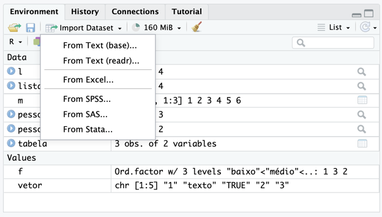
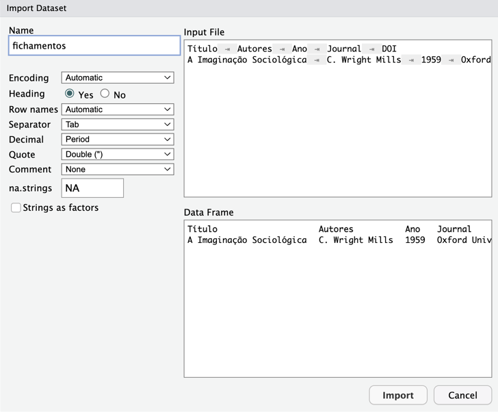

---
# Page settings
layout: default
keywords:
comments: false

# Hero section
title: Estruturas de Dados
description: Curso de análise e visualização de dados

# Author box
author:
    title: coLAB
    title_url: 'https://colab-uff.github.io/'
    external_url: true
    description: Laboratório de Pesquisa em Comunicação, Culturas Políticas e Economia da Colaboração

# Micro navigation
micro_nav: false

# Page navigation
page_nav:
    prev:
        content: Funções Básicas
        url: '/dataviz2_01'
    next:
        content: Tipos de Variáveis
        url: '/dataviz2_03'
---

# Vetores

Vetores são matrizes unidimensionais que podem conter números inteiros, números reais, complexos, caracteres (*strings*) ou valores lógicos.

```
notas <- (c(6.0, 7.1, 5.5, 3.0, 10.0, 100.0, 6.5, 8.2, 2.9, 3.5, 9.9, 
            9.1, 8.2, 7.6, 9.9, 10.0, 6.7, 4.9, 10.0, 6.8, 6.0))
View(notas)

names(notas) <- (c("João", "Maria", "Joaquim", "Ana", "Enzo", "Valentina", "Júlia", "Lucas", "Beatriz", "Carol", "José", 
                   "Daniela", "Daniel", "Manuela", "Luiz", "Fátima", "Gilberto", "Roberta", "Otávio", "Josias", "Helena"))
View(notas)

notas["João"]

notas >= 6.0

notas[notas >= 6.0]
```

O R apresenta também outros tipos de vetores uni, bi, e multidimensionais, que podem representar tabelas ou matrizes de dados. O formato mais comum e intelegível, além do vetor, é o `data.frame`, uma espécie de tabela simples de dados, que combina linhas e colunas. Mas outras estruturas são igualmente frequentes. Abaixo, seguem algumas das principais.

# Listas

Estrutura unidimensional e heterogênea, podendo conter elementos de tipos diferentes, inclusive outras estruturas. Os valores de uma lista são chamados de elementos.

```
lista <- list(1, "texto", TRUE, c(2,3))
```

É possível atribuir nomes aos elementos de uma lista.

```
pessoa <-list(nome = "José da Silva", idade = 27, hobbies = c("Programar, assistir filmes"))
```

Também é possível usar listas como elementos de outras listas. Isso pode ser útil, por exemplo, para combinar listas di­fe­ren­tes em um único registro.

```
pessoa <- list(list(nome = "José da Silva", idade = 27, hobbies = c("Programar, assistir filmes")), list(nome = "Margarida Souza", idade = 32, hobbies = c("Teatro, videogames")), list(nome = "Pedro Antero", idade =23, hobbies = c("Futebol, música")))
```

E, ainda, desaninhar uma lista:

```
lista <- list(1, "texto", TRUE, c(2,3))
vetor <- unlist(lista)
```

Ou transformá-la em uma tabela bidimensional:

```
pessoas <- list(nome=c("José da Silva", "Margarida Souza", "Pedro Antero"), age=c(27, 32, 23))
tabela <- data.frame(pessoas)
print(tabela)
```

A principal diferença entre a lista e o vetor não é a sua condição unidimensional, mas a propriedade de abrigar dados de múltiplas naturezas.


| Estrutura | Tipos de dados                                     | Ideia intuitiva                          |
| --------- | -------------------------------------------------- | ---------------------------------------- |
| **Vetor** | Homogêneo (todos os elementos do mesmo tipo)       | Uma sequência uniforme de valores        |
| **Lista** | Heterogênea (elementos podem ter tipos diferentes) | Um contêiner que guarda objetos variados |

# Matrizes

Estrutura bidimensional homogênea (linhas × colunas), onde todos os elementos têm o mesmo tipo.

```
matriz <- matrix(1:6, nrow = 2, ncol = 3)
```

A matriz, embora uma estrutura bidimensional, não é exatamente o equivalente a uma tabela, visto que somente comporta valores e dados da mesma natureza em todas as suas colunas. Assim, a matriz difere de outra estrutura de dados muito comum no R, o dataframe.


| Estrutura      | Tipos de dados                               | Estrutura interna                             | Uso típico           |
| -------------- | -------------------------------------------- | --------------------------------------------- | -------------------- |
| **Matrix**     | Homogêneo (todos os elementos do mesmo tipo) | Um único vetor organizado em linhas e colunas | Cálculos matemáticos |
| **Data frame** | Heterogêneo por coluna                       | Lista de vetores (cada coluna é um vetor)     | Dados tabulares      |

Todos os elementos precisam ter o mesmo tipo. Se você misturar tipos, o R converte tudo para um tipo comum.

```
matrix(c(1, "a", 3), nrow = 1)

#Todos os campos são automaticamente transformados em texto.
```

# Dataframes

Estrutura tabular bidimensional semelhante a uma planilha. Cada coluna é um vetor e pode ter tipos diferentes.

```
df <- data.frame(
  nome = c("Ana","João"),
  idade = c(30, 25)
)
```

# Factors

Estrutura usada para variáveis categóricas, armazenando níveis (levels). Internamente é um vetor inteiro com rótulos.

```
f <- factor(c("baixo","alto","baixo"))
levels(f)
```

É possível também determinar quais são os fatores (categorias) e até ordená-los.

```
f <- factor(
  c("baixo","alto","baixo","médio"),
  levels = c("baixo","médio","alto")
)
levels(f)
```

Isso é importante para modelos estatísticos e gráficos, pois a ordem influencia resultados.

```
f <- factor(
  c("baixo","alto","médio"),
  levels = c("baixo","médio","alto"),
  ordered = TRUE
)
levels(f)
```

# Tibbles

Versão moderna de dataframe usada no ecossistema `Tidyverse`, com melhor visualização e comportamento mais consistente.

```
library(tibble)
tb <- tibble(x = 1:3, y = c("a","b","c"))
```

# Criando Tabelas e Convertendo Estruturas de Dados

É possível criar um dataframe a partir de múltiplos vetores:

```
notas <- (c(6.0, 7.1, 5.5, 3.0, 10.0, 100.0, 6.5, 8.2, 2.9, 3.5, 9.9, 
            9.1, 8.2, 7.6, 9.9, 10.0, 6.7, 4.9, 10.0, 6.8, 6.0))
nomes <- (c("João", "Maria", "Joaquim", "Ana", "Enzo", "Valentina", "Júlia", "Lucas", "Beatriz", "Carol", "José", 
            "Daniela", "Daniel", "Manuela", "Luiz", "Fátima", "Gilberto", "Roberta", "Otávio", "Josias", "Helena"))
boletim <- cbind(nomes,notas)
View(boletim)
```

E também converter uma estrutura de dados em outra.

```
boletim <- as.matrix(boletim) # Matrix
boletim_lista <- as.list(boletim) # List
boletim <- as.data.frame(boletim) # Dataframe
boletim <- tibble::as_tibble(boletim) # Tibble
```

# Instalação de Pacotes no R

Para instalar pacotes, utilize o comando `install.packages()`, indicando entre aspas o nome do pacote pretendido. É possível também proceder uma instalação pelo modo gráfico, no menu **Packages > Install do R Studio**.

Sempre que um pacote é instalado, é preciso requisitá-lo, antes de começar a usar. Você pode requisitar um pacote por meio da função `library()` ou da função `require()`.

O R fornece uma série de pacotes com *datasets* para testar manipulação de dados. Alguns desses pacotes já estão integrados à *R Base*, como `mtcars` (pacote com dados sobre modelos de carros esportivos). Outros, precisam de instalação adicional, como `palmerpenguins` (pacote com dados sobre pinguins catalogados na Antártida). Vamos visualizar esses dados?

* `mtcars`

```
mtcars

carros <- mtcars

View(carros)
```

*  `palmerpenguins`

```
install.packages("palmerpenguins")
library(palmerpenguins)
penguins

dados_aves <- penguins
View(dados_aves)
```

Para utilizar as funções de um pacote, há duas maneiras. A primeira delas é requisitar o pacote, por meio da função `library()`. A segunda é indicar o nome do pacote imediatamente antes de executar a função. Veja os exemplos abaixo.

```
palmerpenguins::penguins

library(palmerpenguins)
penguins

dados_aves <- penguins
```

# Exportando Dados

Para exportar dados do R, utilize a função `write.csv()`.

* No Mac OS ou no Linux:

```
write.csv(dados_aves, "./Downloads/dados_aves.csv")
```

* No Windows:

```
write.csv(dados_aves, "C:\Users\NomeDoUsuario\Downloads\dados_aves.csv")
```

# Importando Dados

Para importar dados do R, utilize a função `read.csv()`.

* No Mac OS ou no Linux:

```
dados_aves_import <- read.csv("./Downloads/dados_aves.csv")
```

* No Windows:

```
dados_aves_import <- read.csv("C:\Users\NomeDoUsuario\Downloads\dados_aves.csv")
```

Ou pela própria UI:





